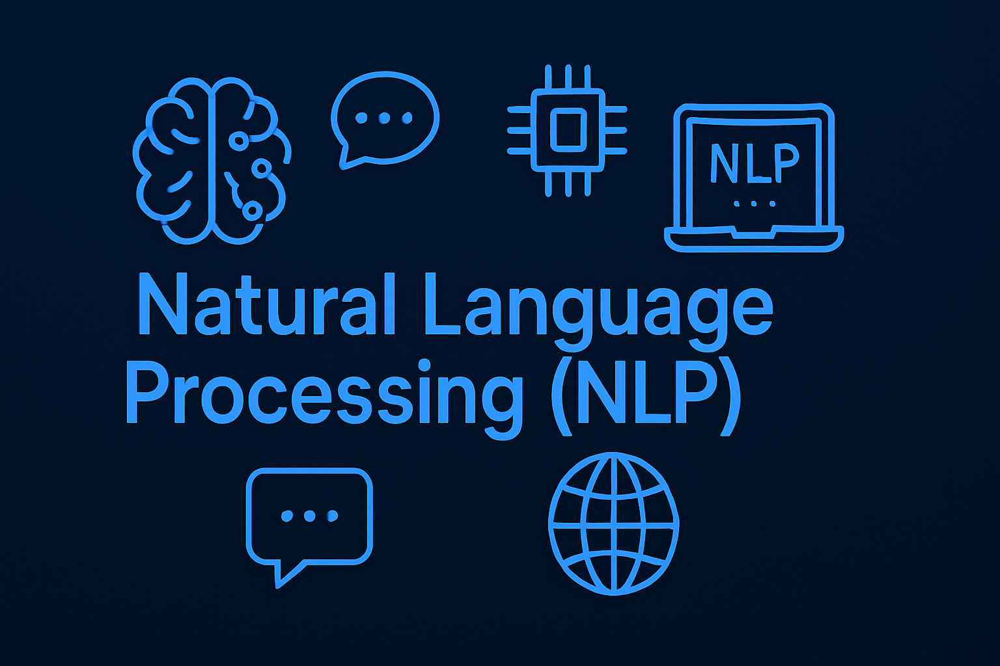

# **🚀 My NLP Journey: From Basics to Industry-Ready Projects**

Natural Language Processing (NLP) has always fascinated me — the ability to make machines understand and generate human language feels like unlocking a superpower. This repository marks the **foundation of my journey**, and I'm documenting everything I learn, practice, and build in this space.

## **📍 Where I Started**

✅ Explored the basics of NLP  
✅ Learned key concepts like tokenization, stopword removal, stemming, and lemmatization  
✅ Built a **robust text preprocessing pipeline** using **spaCy + NLTK**  
✅ Understood **how preprocessing impacts models**  
✅ Applied techniques like:
- Lowercasing
- Punctuation & Emoji Removal
- HTML & URL Stripping
- Chat Slang Normalization
- Contraction Expansion
- Lemmatization vs Stemming
- Stopword Removal
- POS-aware Lemmatization
- Tokenization using spaCy and NLTK

## **📈 What This Repo Offers**

🔹 End-to-end **modular preprocessing functions**  
🔹 Real-world NLP examples with clear input vs output  
🔹 Comparative insights into **spaCy vs NLTK**  
🔹 Easy-to-follow explanations for each concept  
🔹 Visual assets & infographics to simplify learning

    

## **🌟 What's Next on My NLP Roadmap**

🔜 Named Entity Recognition (NER)  
🔜 Text Classification and Sentiment Analysis  
🔜 Topic Modeling and Word Embeddings  
🔜 Building Transformers-based pipelines using BERT & HuggingFace  
🔜 Deploying NLP-powered apps with **Streamlit**, **Flask**, or **Gradio**  
🔜 Creating custom chatbots and question-answering systems
🔜 more in nlp

## **🧠 Why I'm Sharing This**

I believe **learning in public** is the fastest way to grow. This repo serves:
- As my personal learning log 📘  
- A resource for other NLP beginners 🧑‍💻  
- A showcase of my progress toward **becoming a top 1% NLP engineer** 🏆

##  **Connect with me on**

  

  

